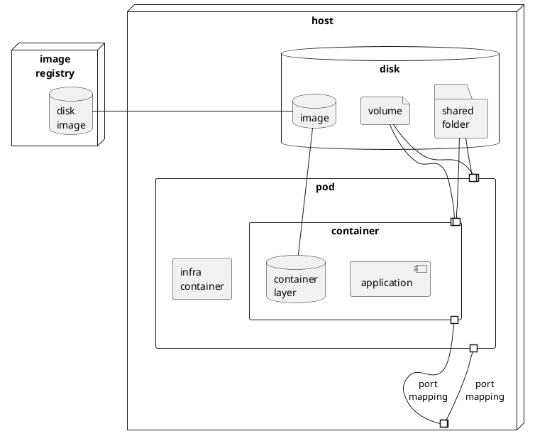

Intro to Podman
===============
2 days, 8 ac.hrs, 7 as.hrs.

Знакомство
==========
1. Роль
1. Текущий уровень с Docker/Podman: 0–3
1. Как поймете, что тренинг дал Вам ценность?

Prerequisites
=============
- [ ] Virtual machine for practice 
- vra8: `IT Academy Training Group`, HDD 50Gb, OS AlmaLinux + local ssh client
- local virtual machine + local ssh client
- [ ] Доступен git repo с данным руководством {{ git-repo }} `https://github.com/eugene-krivosheyev/podman`
- [ ] Доступен {{ registry-host }}
- [ ] Доступ учетной записи {{ registry-account }} на {{ registry-host }}
- [ ] [Установлен Podman и зависимости](https://access.redhat.com/documentation/en-us/red_hat_enterprise_linux_atomic_host/7/html/managing_containers/finding_running_and_building_containers_with_podman_skopeo_and_buildah)
```shell
sudo dnf update
sudo dnf install -y podman
sudo dnf install -y slirp4netns # for rootless containers
```

---

Intro to containerization and Podman <sup>30 мин</sup>
====================================
Задачи контейнеризации
----------------------
- [ ] Переносимость ПО: запуск на разных окружениях – dev, test, prod
- исполняемые файлы нашего ПО 
- зависимости 
- конфигурация 
- аргументы командной строки 
- порты 
- побочные эффекты

Контейнеризация vs виртуализация
--------------------------------
- место на диске для гостевой ОС
- время запуска гостевой ОС
- overhead операций гостевой ОС

Ключевые термины контейнеризации
--------------------------------
- [Схема контейнеризации](img/containerization.svg)
- Host
- Image
- Image Registry
- Container
- Port Mapping
- Mounts
- Pod

<details>
<summary>puml</summary>


</details>

Podman vs другой популярный стиральный порошок
----------------------------------------------
- [ ] `pod`
- bunch of containers
- `infra` container
- `localhost`
- port mappings
- mounts

- [ ] daemonless
- [ ] rootfull and rootless modes 

Hands-on practice quest #00: Prerequisites sound-check and tools install <sup>20 мин парной практики + 10 мин дебриф</sup>
=======================
Given
-----
- [ ] Пары участников с чередованием ролей в паре
- [ ] Форк данного руководства для собственных пометок
- [ ] Форк открыт в браузере для внесения пометок
- [ ] Все команды запускаются из-под суперпользователя
```shell
sudo
```
или
```shell
su -
```

- [ ] Как описать _сценарий_ использования команд?
```shell
- каоманды перевода системы в нужное состояние
- команды действия
- команды проверки успешности и корректности действия 
``` 

- [ ] Hints
- при работе в терминале используйте `Tab` и `↑` для автоподстановки значений
- синонимы команд cli
- `... --help`
- [podman cli reference](https://docs.podman.io/en/latest/Commands.html)


When участники *именуют сценарии*, выполняют команды и анализируют их вывод и поведение
----
- Сценарий "Как ...?"
```shell
podman version # TODO: собственные пометки участников для будущего использования в проектах
podman system info
podman system df
```

- Сценарий "Как ...?"
```shell
podman logout
podman login {{ registry-host }}
```

- Сценарий "Как найти нужный образ в registry?"
Залогиниться браузером по адресу {{ registry-host }}, в поиске найти нужный образ и скопировать полное символьное имя (включая сетевой адрес хоста).

- Сценарий "Как ...?"
```shell
podman image pull {{ registry-host }}/{{ path }}/alpine:3.14
podman system df
````

- Сценарий "Как ...?"
```shell
podman container run hello

podman container run --name demo -it alpine:3.14
/# cat /etc/os-release
/# exit 
```

- Сценарий "Как ...?"
```shell
podman container ls [--all]
podman container rm demo
```

Then участники отвечают на вопросы
----
- Как назвали сценарии?
- Успешна ли сконфигурирована система для использования docker?
- Откуда взялся образ диска?
- Сколько места занимает образ?
- Сколько места занимает контейнер?
- Какая версия образа скачивается по умолчанию?
- Какая гостевая команда запускается при запуске контейнера?

Жизненный цикл готового образа <sup>30</sup>
==============================
Зачем нужен образ
-----------------
- [ ] Задача среды исполнения контейнеров: изоляция ПО от хоста
- [ ] Отображение диска контейнера на диск хоста: _образ_

Что хранит образ
----------------
- [ ] Что должно быть на диске для запуска и работы контейнеризованного приложения?
- [ ] Состав образа диска (от `scratch` до prod-ready)
- OS libraries
- OS package manager (для удобной установки зависимостей, нужен на этапе сборки образа)
- OS commands (для отладки, мониторинга и траблшутинга контейнеров на этапе эксплуатации)
- Application libraries
- Application executables
- Config files
- Data files

```shell
$ podman run --rm -it alpine:3.14 ls
bin    dev    etc    home   lib    media  mnt    opt    proc   root   run    sbin   srv    sys    tmp    usr    var
```

Как идентифицируется образ
--------------------------
```shell
$ podman images
REPOSITORY                TAG         IMAGE ID      CREATED       SIZE
quay.io/podman/hello      latest      577bf902f284  9 hours ago   85.1 kB
<none>                    <none>      4f391b4bf86f  3 days ago    85.1 kB
docker.io/library/alpine  3.14        376ba31ae3da  2 months ago  5.63 MB
docker.io/library/alpine  latest      a6215f271958  2 months ago  5.58 MB
```

- `id` как хеш образа
- `хост/группа/имя` как имя _репозитория_
- `хост/группа/имя:тег` как полное символьное имя

Как создается образ
-------------------
- `podman container run` + side effects > `podman container commit` > `podman image push` # редко используемый "ручной" ЖЦ
- `podman image build` > `podman image push` # штатный автоматизированный ЖЦ

[Как хранится образ](https://docs.oracle.com/en/operating-systems/oracle-linux/podman/podman-ConfiguringStorageforPodman.html)
------------------
- [ ] Overlay FS
```shell
$ podman image history quay.io/podman/hello
ID            CREATED       CREATED BY                                     SIZE        COMMENT
577bf902f284  10 hours ago  /bin/sh -c #(nop) LABEL "org.opencontainer...  0 B         FROM d2f3fdcf80a2
<missing>     10 hours ago  /bin/sh -c #(nop) LABEL "org.opencontainer...  0 B         FROM cc07153b17e6
<missing>     10 hours ago  /bin/sh -c #(nop) LABEL "org.opencontainer...  0 B         FROM d45976f9036e
<missing>     10 hours ago  /bin/sh -c #(nop) CMD ["/usr/local/bin/pod...  0 B         FROM aeedbc3e44e3
<missing>     10 hours ago  /bin/sh -c #(nop) COPY file:d246003209ea6b...  80.9 kB     FROM a796bd9429dc
<missing>     10 hours ago  /bin/sh -c #(nop) USER 1000                    0 B         FROM 190f78d5a9fb
<missing>     10 hours ago  /bin/sh -c #(nop) LABEL artist="Máirín N...    0 B         FROM 78ab72a99b9f
<missing>     10 hours ago  /bin/sh -c #(nop) LABEL maintainer="Podman...  0 B
```

```shell
$ docker run --rm -v /var/run/docker.sock:/var/run/docker.sock nate/dockviz images -t
├─<missing> Virtual Size: 5.6 MB
│ └─<missing> Virtual Size: 5.6 MB
│   └─<missing> Virtual Size: 5.6 MB
│     └─<missing> Virtual Size: 19.8 MB
│       └─<missing> Virtual Size: 19.8 MB
│         └─<missing> Virtual Size: 19.8 MB
│           └─<missing> Virtual Size: 116.7 MB
│             └─<missing> Virtual Size: 116.7 MB
│               ├─<missing> Virtual Size: 116.7 MB
│               │ └─<missing> Virtual Size: 116.7 MB
│               │   └─<missing> Virtual Size: 116.7 MB
│               │     └─<missing> Virtual Size: 136.7 MB
│               │       └─<missing> Virtual Size: 136.7 MB
│               │         └─3c1355b22f16 Virtual Size: 136.7 MB Tags: training-docker/ekr-stub:1.0.0
│               └─<missing> Virtual Size: 116.7 MB
│                 └─<missing> Virtual Size: 116.7 MB
│                   └─<missing> Virtual Size: 116.7 MB
│                     └─<missing> Virtual Size: 116.7 MB
│                       └─e96641ea7cdf Virtual Size: 182.6 MB Tags: training-docker/ekr-backend:1.0.0
```

- [ ] Как управлять образами c [Crane](https://github.com/InfuseAI/crane)


Hands-on practice quest #01: Pre-built disk image lifecycle <sup>20 + 10</sup>
=======================
Given 
-----
- [ ] пары участников

When участники именуют сценарии, выполняют команды и анализируют их вывод и поведение
----
- Сценарий "Как ...?"
```shell
podman image ls # TODO: собственные пометки участников для будущего использования в проектах
```

- Сценарий "Как ...?"
```shell
podman image pull alpine:3.14
podman image ls
```

- Сценарий "Как ...?"
```shell
podman image history alpine:3.14
podman image inspect alpine:3.14 [| jq]
```

- Сценарий "Как ...?"
```shell
podman container run --name demo -it alpine
/# touch side-effect.txt
/# exit
podman container diff demo
podman container commit demo {{ registry-host }}/container-training/{{ registry-account }}/demo
podman image ls
```

- Сценарий "Как ...?"
```shell
podman image tag {{ registry-host }}/container-training/{{ registry-account }}/demo:latest {{ registry-host }}/container-training/{{ registry-account }}/demo:1.0.0
podman image ls
```

- Сценарий "Как ...?"
```shell
podman image push {{ registry-host }}/container-training/{{ registry-account }}/demo:1.0.0
```

- Сценарий "Как ...?"
```shell
podman image ls
podman container rm demo
podman image prune
podman image ls
podman image rm {{ registry-host }}/container-training/{{ registry-account }}/demo:1.0.0
podman image ls
podman image rm {{ registry-host }}/container-training/{{ registry-account }}/demo:latest
podman image ls
podman image prune --all
```

Then участники делятся проблемами и отвечают на вопросы
----
- [ ] Как назвали сценарии?
- [ ] Какой тег у образа по умолчанию?
- [ ] В чем физический смысл удаления образа командой `rm`?
- [ ] Всегда ли удаляется образ по команде `rm`?
- [ ] Что делает prune?
- [ ] Что такое [_dangling_](https://docs.docker.com/config/pruning/#prune-images) image?

Жизненный цикл пода и контейнера <sup>30</sup>
================================
- [x] container = running process + container data (container layer)
- [x] Что значит "запуск" контейнера? Что именно там запускается?
- [ ] Сколько по времени будет работать контейнер?
- [ ] Как можно доопределить команду, запускаемую в контейнере?

- [ ] Что нужно определить для запуска контейнера?
- disk image
- меппинг (форвардинг) портов
- имя контейнера (+defaults)
- virtual network
- folder | volume mapping
- guest environment variables
- command line (image `entrypoint` override)
- command line arguments (image `cmd` override)

- [ ] Жизненный цикл контейнера
- `podman container create` + `podman container start` = `podman container run` `[args]`
- `podman container commit`
- `podman container ls [--all]`
- `podman container logs`
- `podman container stop` & `podman container kill`
- `podman container rm`

- [ ] Запуск контейнера в интерактивном и фоновом режимах: 
- `-i` vs `-d`
- `-t`

- [ ] [Жизненный цикл пода](https://developers.redhat.com/blog/2019/01/15/podman-managing-containers-pods?intcmp=701f20000012ngPAAQ#)
- `podman pod create` & `podman container run --pod [new:]`
- `podman pod ps`
- `podman pod ls`
- `podman pod logs`
- `podman pod stop`
- `podman pod rm`

Hands-on practice quest #02: Pod and Container lifecycle <sup>20 + 10</sup>
=======================
Given
-----
- [ ] пары участников

When участники именуют сценарии, формируют свои сценарии и проверяют их вывод и поведение
----
- Сценарий "Как посмотреть список работающих и остановленных контейнеров?"
```shell
podman container ls --all
```

- Сценарий "Как запустить 'одноразовый' контейнер?"
```shell
podman container run --rm -it alpine:3.14 # note `--rm`
/# exit
podman container ls --all
```

- Сценарий "Как запустить контейнер в фоновом режиме?"
```shell
podman container run --detach --name proxy --publish 8080:80 nginx:1.19.4 # note `--detach` or `-d`
podman container ls
curl localhost:8080
```

- Сценарий "Как 'подключиться' к работающему контейнеру?"
```shell
podman container logs proxy

podman container attach --sig-proxy=false proxy # otherwise detach key `ctrl-c` will stop container 

podman container top proxy

podman container exec -it proxy /bin/sh # run additional process `sh` within _running_ container
```

- Сценарий "Как посмотреть свойства контейнера?"
```shell
podman container port proxy
podman container inspect proxy [| jq]
```

- Сценарий "Как остановить и перезапустить работающий контейнер?"
```shell
podman container stop ... # send SIGTERM, and then SIGKILL after grace period
podman container kill ... # send SIGKILL, or specified signal

podman container start ...
podman container restart ...
```

- Сценарий "Как удалить работающий контейнер?"
```shell
podman container rm --force
```

- Сценарий "Как удалить остановленный контейнер?"
```shell
podman container rm ...
podman container prune ...
```

- Сценарий "Как создать под?"
```shell
podman ...
```

- Сценарий "Как запустить контейнер с добавлением его в под?"
```shell
podman ...
```

- Сценарий "Как посмотреть список подов?"
```shell
podman ...
```

- Сценарий "Как посмотреть список контейнеров в поде?"
```shell
podman pod ps
podman ps -a --pod
podman pod inspect ...
```

- Сценарий "Как посмотреть логи контейнеров в поде?"
```shell
podman logs --latest ...
```

- Сценарий "Как сгенерировать k8s manifest из готового пода?"
```shell
podman generate kube ...
```

- Сценарий "Как остановить под?"
```shell
podman ...
```

Then участники делятся проблемами и отвечают на вопросы
----
- Какие способы идентификации контейнера?
- Какое имя у контейнера по умолчанию?
- Где можно определить конфигурацию сети (например, меппинг портов) – для контейнера или для пода?
- Что за логи наблюдаются для контейнера и пода? 
- В чем физический смысл удаления контейнера?
- В чем физический смысл удаления пода?
- Что делает `container prune`?
- Что такое k8s manifest?


Контейнеризация простого сервиса: автоматическая сборка образа <sup>40</sup>
================================
Задачи автоматических сборщиков
-------------------------------
- [ ] На выходе бинарный файл образа
- [ ] На входе дескриптор сборки образа `Containerfile`/`Dockerfile`
- [ ] Что должно быть в этом дескрипторе?

Как собрать с `Containerfile` и Buildah под капотом
---------------------------------------------------
- [ ] [Ключевые директивы Containerfile](https://www.mankier.com/5/Containerfile)
- [`FROM`](https://docs.docker.com/engine/reference/builder/#from) + [`--platform=`](https://www.docker.com/blog/faster-multi-platform-builds-dockerfile-cross-compilation-guide/)
- [`WORKDIR`](https://docs.docker.com/engine/reference/builder/#workdir) создаст папку при необходимости
- [`COPY`](https://docs.docker.com/engine/reference/builder/#copy) [and](https://stackoverflow.com/questions/24958140/what-is-the-difference-between-the-copy-and-add-commands-in-a-dockerfile/24958548#24958548) [`ADD`](https://docs.docker.com/engine/reference/builder/#add) from build context (+ [`.dockerignore`](https://docs.docker.com/engine/reference/builder/#dockerignore-file))
- [`RUN`](https://docs.docker.com/engine/reference/builder/#run) (+ `shell` and preferred `exec` forms) and [`SHELL`](https://docs.docker.com/engine/reference/builder/#shell) for non-default shell
- [`EXPOSE`](https://docs.docker.com/engine/reference/builder/#expose) documentation
- [`ENTRYPOINT`](https://docs.docker.com/engine/reference/builder/#entrypoint) [and](https://docs.docker.com/engine/reference/builder/#understand-how-cmd-and-entrypoint-interact) [`CMD`](https://docs.docker.com/engine/reference/builder/#cmd) (+ preferred `exec` and similar `default parameters to ENTRYPOINT`, `shell` forms)
- [`LABEL`](https://docs.docker.com/engine/reference/builder/#label)

```shell
podman container run [--entrypoint Dockerfile's ENTRYPOINT override] IMAGE [Dockerfile's CMD defaults override] 
```
```shell
FROM alpine
ENTRYPOINT ["echo", "Hello"]
CMD ["World"] # 'default parameters to ENTRYPOINT' form
...
$ podman build --tag test .
...
$ podman run --rm test
Hello World
...
$ podman run --rm test Alpine
Hello Alpine
```

- [ ] Системные образы для базы VS прикладные образы с приложениями

- [ ] Кратко по оптимизации сборки:
- Сборка `FROM scratch`, "пинцетный метод"
- Использование легковесных базовых образов
```shell
alpine 5.33MB
registry.access.redhat.com/ubi8/ubi-micro 51.6MB
ubuntu 65.6MB
debian:stable-slim 74.3MB
```
- Понятие build context и кеширование при сборке (+ .dockerignore)
- Изменение порядка директив в Dockerfile, чтобы максимально повторно использовать кеш builder
- Объединение директив, чтобы снизить количество слоёв образа
- Multi-stage build, чтобы не тащить в итоговый образ инфраструктуру сборки
- Объединение слоёв образа в один слой

---

Hands-on practice quest #03: Simple java application containerization with Buildah <sup>30 + 10</sup>
=======================
Given
-----
- [ ] Склонирован git repo c приложением
```shell
application
└── backend
    ├── Containerfile
    └── dbo-1.0-SNAPSHOT.jar
```
- [ ] Задана рабочая папка
```shell
cd application
```
- [ ] Проведена аутентификация консольного Podman CLI в Registry
```shell
podman login ...
```

When участники именуют сценарии, формируют свои команды и проверяют их вывод и поведение
----
- [ ] Сценарий "Как собрать образ на основе Containerfile?"
```shell
vi backend/Containerfile # Replace base image with one that suitable for corporate image registry
podman image build \
  --tag {{ registry-host }}/container-training/{{ registry-account }}/app:1.0.0 \ # set up symbolic name for image
  ./backend # folder where Containerfile located

podman image ls
```

- [ ] Сценарий "Как запустить 'одноразовый' контейнер на базе своего образа с приложением?"
```shell
podman container run \
 --name backend \
 --rm \ # одноразовый: удалится после остановки
 --detach \ # -d
 --publish 8080:8080 \ # -p [host address:]8080:8080
 --env SPRING_PROFILES_ACTIVE=qa \ # -e: в контейнере действует переменная окружения
 --volume $(pwd)/log:/dbo/log \ # -v: папка в конейнере /dbo/log отображена на папку на хосте /current-path/log. Windows caution for $()!
 {{ registry-host }}/container-training/{{ registry-account }}/app:1.0.0 \ #  имя и тег
  --spring.profiles.active=qa # параметры командной строки
```

- [ ] Сценарий "Как протестировать запущенное в контейнере приложение?"
```shell
podman container ls --all # Check for status

curl localhost:8080/dbo/actuator/health
open http://localhost:8080/dbo/swagger-ui/
```

- [ ] Сценарий "Как мягко остановить приложение средствами самого приложения?"
```shell
curl -X POST localhost:8080/dbo/actuator/shutdown
```

- [ ] Сценарий "Как опубликовать проверенный образ в репозитории?"
```shell
podman image push ...
```

Then участники делятся проблемами и отвечают на вопросы
----
- [ ] В каком порядке выполнялись директивы Dockerfile?
- [ ] Сколько новых layers добавила сборка к базовому образу?
- [ ] Когда и по какой причине остановился контейнер?
- [ ] Что происходит с процессом приложения, когда останавливаем контейнер?
- [ ] Сколько раз вы столкнулись с настройкой экстернализированной конфигурации приложения?

Изоляция данных <sup>20</sup>
===============
- [x] Что происходит с изменениями в образе при остановке контейнера?
- [x] Как зафиксировать изменения в образе?
- [x] Как откатить изменения в образе?
- [ ] Как можно сохранять изменения на диске _вне_ образа? (stateful containers): mounts
- tmpfs
```shell
docker container run 
 --tmpfs /tmp
 --tmpfs /var/log
 --tmpfs /dbo/log 
```
- shared folders
```shell
podman container run --volume "$(pwd)"/folder/file:/folder/file:ro # пути у folder абсолютные, начинаются с "/"
```
- volumes
```shell
podman container run --volume my_volume:/folder/file:ro # имя volume не начинается с "/"
```

- [ ] Логи
- консольные логи: stdout/stderr
- собираются и упаковываются в выбранный формат (определяется log driver)
```shell
podman logs [--until=10s] ...
```

Hands-on practice quest #04: Simple _stateful_ application containerization <sup>20 + 10</sup>
=======================
Given
-----
- [ ] Собран образ с приложением

When участники именуют сценарии, формируют свои команды и проверяют их вывод и поведение
----
- [ ] Сценарий "Как запустить stateful container c пробросом на хостовую папку?"
```shell
podman container run \
 -- ... \ # TODO имя контейнера
 -- ... \ # TODO одноразовый: удалится после остановки
 -- ... \ # TODO фоновой режим
 -- ... \ # TODO проброс порта на хост
 -- ... \ # TODO профиль конфигурации Spring 'qa'
 --volume $(pwd)/log:/dbo/log \ # -v: папка в конейнере /dbo/log отображена на папку на хосте /current-path/log. Windows caution for $()!
 {{ registry-host }}/container-training/{{ registry-account }}/app:1.0.0

open $(pwd)/log
```

Then участники делятся проблемами и отвечают на вопросы
----
- [ ] В данных сценариях какой тип mount лучше подойдет? tmpfs, shared folder, volume?

Оркестрация <sup>40</sup>
===========
Задачи оркестраторов
--------------------
- [ ] Зачем нужны оркестраторы?
- [ ] Понятие 'сервиса' в оркестраторах
- [ ] Структура дескриптора оркестратора Compose

Управление группой контейнеров с Podman Compose
------------------------------------------------
```shell
cd application
podman compose up --detach
podman compose down
```

Hands-on practice quest #05: Multi-component stateful application containerization with Compose <sup>30 + 10</sup>
=======================
Given
-----
- [ ] Установлен Podman Compose
```shell
sudo dnf install -y pip
pip3 install https://github.com/containers/podman-compose/archive/devel.tar.gz
```

When
----
Then
----

Рекомендуемые практики <sup>30</sup>
======================
- [ ] Минимизировать [security риски](https://snyk.io/blog/10-docker-image-security-best-practices)
1. Используйте минимальные образы: быстрее и меньше зависимостей + меньше рисков
1. Запуск в rootless mode
1. Подписывать образы и проверять подписи
1. [Сканеры уязвимостей](https://techbeacon.com/security/10-top-open-source-tools-docker-security) для образов `docker scan --dependency-tree <image>`
1. [Линтеры](https://medium.com/@renatomefi/writing-dockerfile-like-a-software-developer-linting-9fd8c620174) для Dockerfile
1. [COPY вместо ADD](https://nickjanetakis.com/blog/docker-tip-2-the-difference-between-copy-and-add-in-a-dockerile) + .dockerignore
1. Фиксированные теги для идентификации образов (Semantic versioning or Unique tags)
1. _Multi-Stage Build_ в том числе для того, чтобы в итоговый образ не утекли чувствительные данные
1. Хранение и передача конфигурации и чувствительных данных: _Secrets_
