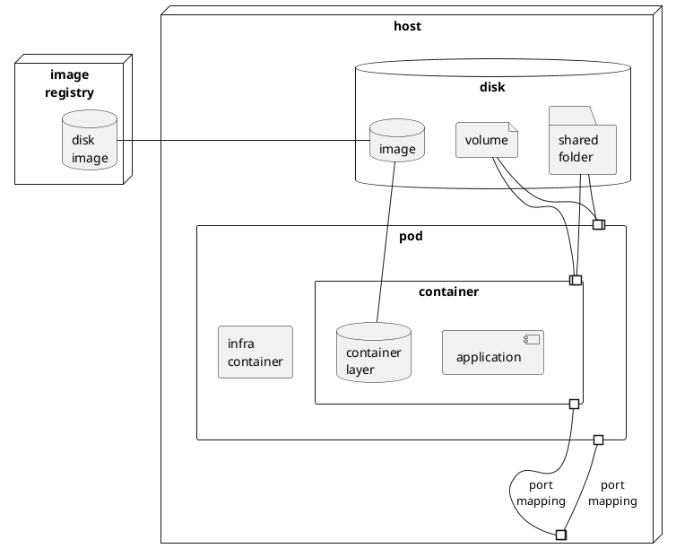

Intro to Podman
===============
2 days, 8 ac.hrs, 7 as.hrs.

Prerequisites
=============
- [ ] Virtual machine for practice
- [ ] RAM ≥ 4Gb
- [ ] Доступен git repo с данным руководством {{ git-repo }} `https://github.com/eugene-krivosheyev/podman`
- [ ] Доступен {{ registry-host }}
- [ ] Доступ учетной записи {{ registry-account }} на {{ registry-host }}
- [ ] Установлен Podman и зависимости
```shell
sudo dnf install -y podman
```

---

Intro to containerization and Podman <sup>30 мин</sup>
====================================
Задачи контейнеризации
----------------------
- [ ] Переносимость ПО: запуск на разных окружениях – dev, test, prod
- исполняемые файлы нашего ПО 
- зависимости 
- конфигурация 
- аргументы командной строки 
- порты 
- побочные эффекты

Контейнеризация vs виртуализация
--------------------------------
- место на диске для гостевой ОС
- время запуска гостевой ОС
- overhead операций гостевой ОС

Ключевые термины контейнеризации
--------------------------------
- [Схема контейнеризации](img/containerization.svg)
- Host
- Image
- Image Registry
- Container
- Port Mapping
- Mounts
- Pod

<details>
<summary>puml</summary>


</details>

Podman vs другой популярный стиральный порошок
----------------------------------------------
- [ ] `pod`
- bunch of containers
- `infra` container
- `localhost`
- port mappings
- mounts

- [ ] daemonless
- [ ] rootfull and rootless modes 

Hands-on practice quest #00: Prerequisites sound-check and tools install <sup>20 мин парной практики + 10 мин дебриф</sup>
=======================
Given
-----
- [ ] Пары участников с чередованием ролей в паре
- [ ] Форк данного руководства для собственных пометок
- [ ] Форк открыт в браузере для внесения пометок
- [ ] Для последующей удобной работы с copy+paste для ресурсов раздела [Prerequisites](#Prerequisites) плейсхолдеры заменены актуальными значениями

- [ ] Как описать _сценарий_ использования команд?
```shell
- каоманды перевода системы в нужное состояние
- команды действия
- команды проверки успешности и корректности действия 
``` 

- [ ] Hints
- при работе в терминале используйте `Tab` и `↑` для автоподстановки значений
- синонимы команд cli
- `... --help`
- [podman cli reference](https://docs.podman.io/en/latest/Commands.html)


When участники *именуют сценарии*, выполняют команды и анализируют их вывод и поведение
----
- Сценарий "Как ...?"
```shell
podman version # TODO: собственные пометки участников для будущего использования в проектах
podman system info
podman system df
```

- Сценарий "Как ...?"
```shell
podman logout
podman login {{ registry-host }}
```

- Сценарий "Как ...?"
```shell
podman image pull alpine:3.14
podman system df
````

- Сценарий "Как ...?"
```shell
podman container run hello

podman container run --name demo -it alpine:3.14
/# cat /etc/os-release
/# exit 
```

- Сценарий "Как ...?"
```shell
podman container ls [--all]
podman container rm demo
```

Then участники отвечают на вопросы
----
- Как назвали сценарии?
- Успешна ли сконфигурирована система для использования docker?
- Откуда взялся образ диска?
- Сколько места занимает образ?
- Сколько места занимает контейнер?
- Какая версия образа скачивается по умолчанию?
- Какая гостевая команда запускается при запуске контейнера?

Жизненный цикл готового образа <sup>30</sup>
==============================
Как идентифицируется образ
--------------------------

Как управлять образами c Crane
------------------------------

Как хранится образ
------------------

Hands-on practice quest #01: Pre-built disk image lifecycle with Crane <sup>20 + 10</sup>
=======================


Жизненный цикл пода и контейнера <sup>30</sup>
================================

Hands-on practice quest #02: Pod and Container lifecycle <sup>20 + 10</sup>
=======================


Контейнеризация простого сервиса: автоматическая сборка образа <sup>40</sup>
================================
Задачи сборщиков
----------------

Как собирать с Buildah
----------------------


---

Hands-on practice quest #03: Simple java application containerization with Buildah <sup>30 + 10</sup>
=======================

Изоляция данных <sup>20</sup>
===============

Hands-on practice quest #04: Simple _stateful_ application containerization <sup>20 + 10</sup>
=======================

Оркестрация <sup>40</sup>
===========
Задачи оркестраторов
--------------------

Управление группой контейнеров с Podman Compose
------------------------------------------------

Hands-on practice quest #05: Multi-component stateful application containerization with Compose <sup>30 + 10</sup>
=======================

Рекомендуемые практики <sup>30</sup>
======================
